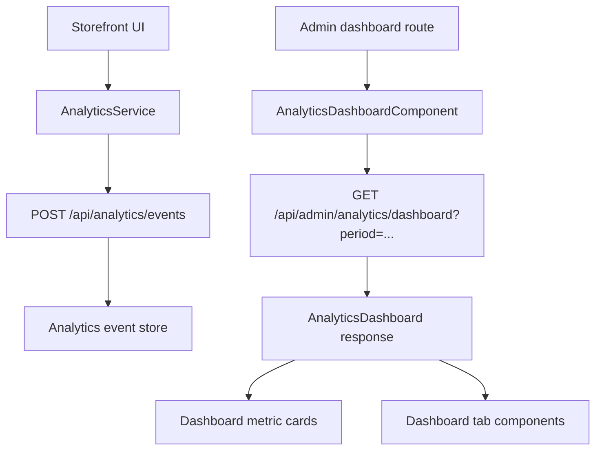

# Dashboard Analytics

This document describes the Project Orange admin analytics dashboard: what it measures, how the data flows through the app, how the mock API builds the dashboard response, and how to extend or test the feature.

## Overview

The analytics dashboard is the admin view at:

```text
/analytics-dashboard
```

Local example:

```text
http://localhost:4200/analytics-dashboard
```

The dashboard is owned by the standalone admin app under `projects/admin`. Storefront pages continue to record analytics events through the shared analytics service.

The dashboard summarizes storefront behavior using event-style analytics. It is designed to answer:

- How much traffic is visiting the storefront?
- How many product impressions convert into cart actions?
- How many carts progress to checkout?
- How many checkout starts become purchases?
- Which products and categories generate the most revenue?
- How many payment attempts fail, and what value is recoverable?
- Which orders are most recent?

## Feature Map

Primary implementation files:

| Area | File |
| --- | --- |
| Dashboard route | `projects/admin/src/app/app.routes.ts` |
| Dashboard container | `projects/admin/src/app/pages/analytics-dashboard/dashboard/dashboard.component.ts` |
| Dashboard layout | `projects/admin/src/app/pages/analytics-dashboard/dashboard/dashboard.component.html` |
| Dashboard styling | `projects/admin/src/app/pages/analytics-dashboard/dashboard/dashboard.component.scss` |
| Shared tab math | `projects/admin/src/app/pages/analytics-dashboard/dashboard/components/dashboard-tab.utils.ts` |
| Shared chart options | `projects/admin/src/app/pages/analytics-dashboard/dashboard/components/dashboard-chart.utils.ts` |
| Reusable chart wrappers | `projects/admin/src/app/pages/analytics-dashboard/charts/` |
| Analytics models | `projects/storefront/src/app/core/models/analytics.model.ts` |
| Analytics client service | `projects/storefront/src/app/core/services/analytics.service.ts` |
| Empty dashboard helpers | `projects/storefront/src/app/core/services/analytics.helpers.ts` |
| Local mock API | `mock-api/server.cjs` |
| Tab unit test fixtures | `projects/admin/src/app/pages/analytics-dashboard/dashboard/components/dashboard-tab.spec-fixtures.ts` |
| E2E coverage | `e2e/app.spec.ts` |

Dashboard tab components:

| Tab | Component | Purpose |
| --- | --- | --- |
| Overview | `OverviewTabComponent` | Executive summary, funnel health, and top products snapshot. |
| Revenue | `RevenueTabComponent` | Revenue metric cards, daily or monthly revenue trend, and revenue by category. |
| Orders | `OrdersTabComponent` | Order metric cards and recent purchase summaries. |
| Visitors | `VisitorsTabComponent` | Visitor and product-view activity by day, latest first. |
| Funnel | `FunnelTabComponent` | Full conversion funnel with rates from visitors and prior steps. |
| Top Products | `TopProductsTabComponent` | Product and category ranking by revenue, views, carts, units, and conversion. |
| Payment Failures | `PaymentFailuresTabComponent` | Failure metric cards and a recent failure log. |

## Data Flow



The storefront client records events while users move through shopping flows. The admin dashboard loads an aggregated `AnalyticsDashboard` object for the selected reporting period.

In the standalone admin app, the dashboard requests:

```text
/api/admin/analytics/dashboard
```

The analytics mock API still supports both scoped and unscoped forms.

## Analytics Events

The dashboard is built from `AnalyticsEvent` records.

```ts
export type AnalyticsEventType =
  | 'visitor'
  | 'product_view'
  | 'add_to_cart'
  | 'checkout_start'
  | 'purchase'
  | 'payment_failure';
```

Common event fields:

| Field | Required | Notes |
| --- | --- | --- |
| `id` | Yes | Client-generated or mock-generated event ID. |
| `type` | Yes | One of the supported event types. |
| `occurredAt` | Yes | ISO timestamp used for period filtering and daily/monthly buckets. |
| `visitorId` | Yes | Used to count unique visitors. |
| `sessionId` | Yes | Used for event grouping and dedupe behavior. |
| `productId` | Product events | Product identifier for product ranking. |
| `productName` | Product events | Display name in product ranking. |
| `categoryName` | Product events | Used for category ranking. |
| `quantity` | Cart and purchase events | Number of units represented by an item or cart action. |
| `value` | Revenue/failure events | Monetary value for purchases and payment failures. |
| `orderNumber` | Purchase events | Used in the recent orders table and duplicate-purchase protection. |
| `failureReason` | Payment failures | Displayed in the failure log. |
| `items` | Checkout, purchase, failure | Product-line details used for units and rankings. |

## Event Producers

The current storefront records analytics through `AnalyticsService`.

| Event | Producer | Trigger |
| --- | --- | --- |
| `visitor` | `App` | App initialization. One visitor event per browser session per day. |
| `product_view` | `ProductListComponent` | Product list emits a distinct visible product set. Each product is tracked once per session/day. |
| `add_to_cart` | `ProductListComponent` | User clicks Buy on a product card. |
| `checkout_start` | `CheckoutComponent` | Checkout page initializes with a cart. Tracked once per session/day. |
| `purchase` | `CheckoutComponent` | Order placement succeeds. Duplicate purchase events for the same order number are suppressed per session/day. |
| `payment_failure` | `CheckoutComponent` | Order placement fails. Captures cart value and a normalized reason. |

Session-level dedupe keys are stored in `sessionStorage` under keys beginning with:

```text
orange.analytics.
```

The visitor and session IDs are also stored in `sessionStorage`:

```text
orange.analytics.visitorId
orange.analytics.sessionId
```

Analytics collection only runs in the browser. Server-side rendering paths skip browser storage and event recording.

## API Endpoints

### Load dashboard

```http
GET /api/admin/analytics/dashboard?period=last-7-days
GET /api/:site/admin/analytics/dashboard?period=last-7-days
```

Supported periods:

| Period | Meaning |
| --- | --- |
| `last-7-days` | Current day plus the prior 6 days. This is the default. |
| `past-month` | Current day plus the prior 29 days. |
| `past-year` | Current month plus the prior 11 months for trend buckets. |
| `from-start` | All available events. Uses daily buckets up to 45 days, then monthly buckets. |

Invalid or missing periods fall back to `last-7-days`.

### Record events

```http
POST /api/analytics/events
POST /api/:site/analytics/events
```

The client sends:

```json
{
  "events": [
    {
      "id": "purchase-...",
      "type": "purchase",
      "occurredAt": "2026-06-20T10:30:00.000Z",
      "visitorId": "visitor-...",
      "sessionId": "session-...",
      "orderNumber": "OR-20260618-0001",
      "value": 59999,
      "items": [
        {
          "productId": 1,
          "productName": "iPhone 15",
          "categoryName": "Phones",
          "price": 59999,
          "quantity": 1
        }
      ]
    }
  ]
}
```

The mock API accepts an array, an `{ events: [...] }` object, or a single event object. Events with unsupported `type` values are ignored. Duplicate purchase events with the same `orderNumber` and site are not stored twice.

## Dashboard Response Contract

`AnalyticsDashboard` is the full response consumed by the dashboard.

| Field | Type | Meaning |
| --- | --- | --- |
| `visitors` | `number` | Unique visitor IDs from `visitor` events. |
| `productViews` | `number` | Count of `product_view` events. |
| `addToCarts` | `number` | Count of `add_to_cart` events. |
| `checkoutStarts` | `number` | Count of `checkout_start` events. |
| `purchases` | `number` | Count of `purchase` events. |
| `revenue` | `number` | Sum of purchase event `value`. |
| `averageOrderValue` | `number` | `revenue / purchases`, or `0` when purchases are `0`. |
| `addToCartRate` | `number` | `addToCarts / productViews`, or `0` when product views are `0`. |
| `checkoutStartRate` | `number` | `checkoutStarts / addToCarts`, or `0` when add-to-carts are `0`. |
| `purchaseConversionRate` | `number` | `purchases / visitors`, or `0` when visitors are `0`. |
| `cartAbandonmentRate` | `number` | `max(addToCarts - purchases, 0) / addToCarts`, or `0` when add-to-carts are `0`. |
| `paymentFailures` | `number` | Count of `payment_failure` events. |
| `paymentFailureRate` | `number` | `paymentFailures / (purchases + paymentFailures)`, or `0` when the denominator is `0`. |
| `unitsSold` | `number` | Sum of quantities across purchased items. |
| `daily` | `AnalyticsDailyPoint[]` | Daily or monthly trend buckets. |
| `funnel` | `AnalyticsFunnelStep[]` | Conversion steps with value and rates. |
| `topProducts` | `AnalyticsTopProduct[]` | Up to 8 products sorted by revenue, then views. |
| `topCategories` | `AnalyticsTopCategory[]` | Categories sorted by revenue, then views. |
| `orders` | `AnalyticsOrderSummary[]` | Up to 10 most recent purchases. |
| `paymentFailureEvents` | `AnalyticsPaymentFailureSummary[]` | Up to 12 most recent payment failures. |

## Metric Formulas

All division uses safe division. If the denominator is `0`, the result is `0`.

| Metric | Formula |
| --- | --- |
| Visitors | Unique `visitorId` count from `visitor` events. |
| Product views | Number of `product_view` events. |
| Add-to-cart events | Number of `add_to_cart` events. |
| Checkout starts | Number of `checkout_start` events. |
| Purchases | Number of `purchase` events. |
| Revenue | Sum of `value` from purchase events. |
| Units sold | Sum of `items[].quantity` from purchase events. |
| Average order value | `revenue / purchases`. |
| Add-to-cart rate | `addToCarts / productViews`. |
| Checkout start rate | `checkoutStarts / addToCarts`. |
| Purchase conversion | `purchases / visitors`. |
| Cart abandonment | `max(addToCarts - purchases, 0) / addToCarts`. |
| Payment failure rate | `paymentFailures / (purchases + paymentFailures)`. |

## Trend Buckets

The `daily` field is named for the dashboard UI, but it can contain either daily or monthly points.

Daily buckets are used for:

- `last-7-days`
- `past-month`
- `from-start` when the full period is 45 days or fewer

Monthly buckets are used for:

- `past-year`
- `from-start` when the full period is more than 45 days

Each point contains:

```ts
interface AnalyticsDailyPoint {
  dateKey: string;
  label: string;
  visitors: number;
  productViews: number;
  addToCarts: number;
  checkoutStarts: number;
  purchases: number;
  revenue: number;
  paymentFailures: number;
}
```

For daily points, `dateKey` is `YYYY-MM-DD`. For monthly points, the key is month-based and the label is a month label.

## Funnel Model

The funnel contains five ordered steps:

1. Visitors
2. Product views
3. Add to cart
4. Checkout started
5. Purchases

Each step includes:

| Field | Meaning |
| --- | --- |
| `label` | Display label for the step. |
| `value` | Count for the step. |
| `rateFromPrevious` | Current step value divided by the previous step value. Visitors use `1`. |
| `rateFromVisitors` | Current step value divided by total visitors. |

The dashboard renders funnel bars with `barWidth(value, max)`. Non-positive values render `0%`. Positive values render at least `4%` so very small values remain visible.

## Product and Category Rankings

`topProducts` is built from product view, add-to-cart, and purchase events.

For each product:

- `views` increments by `1` for each product view.
- `addToCarts` increments by the event `quantity`, or `1` when missing.
- `unitsSold` increments by purchased item quantity.
- `revenue` increments by `price * quantity` for purchased items.
- `conversionRate` is `unitsSold / views`.

Products are sorted by:

1. Revenue, descending
2. Views, descending

Only the top 8 products are returned.

`topCategories` rolls up the already-ranked product summaries by `categoryName`, then sorts by:

1. Revenue, descending
2. Views, descending

## Orders and Payment Failures

Recent orders are derived from purchase events.

Each `AnalyticsOrderSummary` includes:

- `orderNumber`
- `occurredAt`
- `items`
- `units`
- `revenue`

Orders are sorted newest first and limited to 10 rows.

Payment failures are derived from `payment_failure` events.

Each `AnalyticsPaymentFailureSummary` includes:

- `id`
- `occurredAt`
- `amount`
- `reason`
- `items`

Failures are sorted newest first and limited to 12 rows. If no reason is provided, the mock API uses:

```text
Payment authorization failed
```

## Dashboard Container Behavior

`AnalyticsDashboardComponent` owns the period selector and high-level metric-card construction.

Important state:

| Property | Meaning |
| --- | --- |
| `periodOptions` | The supported period menu options. |
| `selectedPeriod` | Currently selected period. Defaults to `last-7-days`. |
| `dashboard` | Readonly signal from `AnalyticsService`. |
| `currency` | Current site currency from `SiteService`, with `PHP` fallback. |

On init, the component calls:

```ts
this.analytics.loadDashboard(this.selectedPeriod());
```

When a period is selected:

1. The menu closes.
2. The selected period signal updates.
3. The dashboard is reloaded with the new period.

The dashboard service tracks the latest request ID and only applies the newest dashboard response. This prevents older, slower responses from overwriting the current period.

## Metric Cards

Metric cards are built in the container and passed into tabs as `AnalyticsMetricCard[]`.

```ts
export interface AnalyticsMetricCard {
  label: string;
  value: string;
  helper: string;
  info: string;
  tone?: 'default' | 'good' | 'warning' | 'danger';
}
```

`info` is a plain string and is passed to `InfoTooltipComponent` as the tooltip description.

Tone usage:

| Tone | Current usage |
| --- | --- |
| `good` | Positive performance indicators such as revenue or healthy conversion. |
| `warning` | Cart abandonment above `70%` or any payment failures. |
| `danger` | Payment failure rate above `12%`. |
| `default` | Neutral metrics. |

## Local Mock API

Run the analytics mock API with:

```bash
npm run mock:api
```

It starts `mock-api/server.cjs` on:

```text
http://localhost:5176
```

The dev proxy in `proxy.conf.cjs` sends analytics requests to the mock API when it is available. If the mock is not running, analytics requests fall back to the primary backend target:

```text
http://localhost:5175
```

The mock API initializes analytics from either:

- `db.json` `analyticsEvents`, when present
- generated seed events from `createSeedEvents()`, when `analyticsEvents` is absent

Seed events span historical data across roughly two years and include visitors, product views, add-to-carts, checkout starts, purchases, and payment failures. This lets the dashboard show meaningful values for all period options.

## Site Scoping

Analytics events may include a `site` field. The mock API filters events by site when the request is site-scoped:

```text
GET /api/ph/admin/analytics/dashboard
```

or when a query parameter is provided:

```text
GET /api/admin/analytics/dashboard?site=ph
```

Events without a site are treated as available to all sites in the mock. In production, prefer storing a normalized site code on each event so site dashboards do not mix traffic.

## Running Locally

Start the standalone admin app:

```bash
npm run ng -- serve admin
```

For dashboard data, start the mock API in another terminal:

```bash
npm run mock:api
```

Then open the admin route:

```text
http://localhost:4200/analytics-dashboard
```

## Testing

### Unit tests

The dashboard has two levels of unit coverage:

- `dashboard.component.spec.ts` covers the container, period options, and reload behavior.
- Each tab component has a colocated `*.component.spec.ts` file.

The tab specs share fixtures from:

```text
projects/admin/src/app/pages/analytics-dashboard/dashboard/components/dashboard-tab.spec-fixtures.ts
```

Run unit tests with:

```bash
npm run test:ci
```

Useful compiler-only checks:

```bash
npx tsc -p projects/storefront/tsconfig.spec.json --noEmit
npx ngc -p projects/storefront/tsconfig.spec.json --noEmit
```

### End-to-end tests

The Playwright suite covers the admin dashboard route and period switching in:

```text
e2e/app.spec.ts
```

The e2e test mocks:

- Admin auth session
- Dashboard response for `last-7-days`
- Dashboard response changes for `past-year`

Run e2e tests with:

```bash
npm run e2e
```

CI installs Chromium and runs e2e tests as part of the main validation workflow.

## Adding A New Metric

Use this checklist when adding a dashboard metric:

1. Add or confirm the analytics event source in `AnalyticsService`.
2. Update `AnalyticsEvent` or related item models if the event needs new fields.
3. Update the backend or mock aggregation in `mock-api/server.cjs`.
4. Add the field to `AnalyticsDashboard` if it is a top-level metric.
5. Add a metric card in `AnalyticsDashboardComponent` or render the value in a tab.
6. Add or update the relevant tab unit test.
7. Update the dashboard e2e test if the new metric is user-critical.
8. Update this README with the metric definition and formula.

## Adding A New Tab

Use this checklist when adding a dashboard tab:

1. Create a standalone component under `projects/admin/src/app/pages/analytics-dashboard/dashboard/components/<tab-name>-tab/`.
2. Add the tab component to `AnalyticsDashboardComponent.imports`.
3. Add a `<mat-tab>` entry in `dashboard.component.html`.
4. Pass only the inputs the tab needs.
5. Keep tab-specific computation local when it only affects that tab.
6. Put shared display helpers in `dashboard-tab.utils.ts`.
7. Add a colocated `*.component.spec.ts`.
8. Add e2e coverage if the tab represents a critical admin workflow.

## Operational Notes

- The dashboard intentionally ignores failed dashboard loads in the client service. A failed request leaves the current dashboard signal unchanged.
- The initial dashboard state comes from `createEmptyDashboard()`, so the UI can render before the first request completes.
- Event recording posts return a dashboard response in the mock API. The client applies that response when it is the latest analytics request.
- Purchase events are deduped by order number in both the client session flow and the mock API store.
- Trend labels are formatted by the mock API, so production services should return display-ready labels or match the current contract.
- Currency formatting is handled in the Angular UI with the active site currency.
